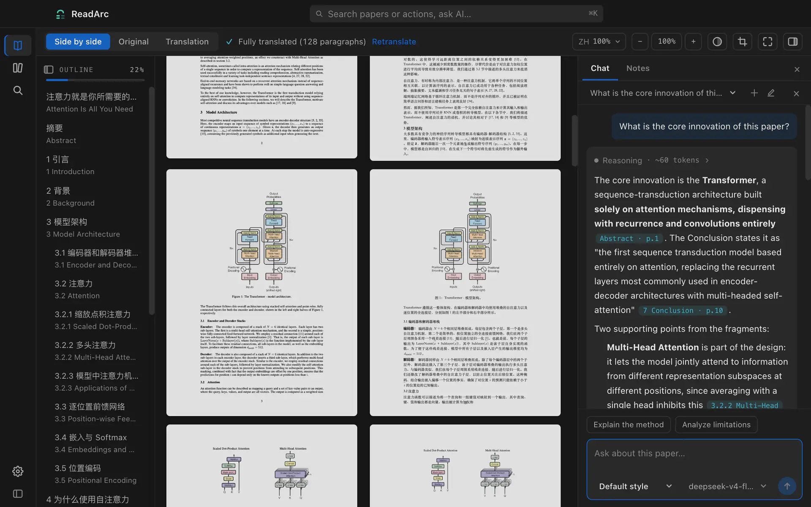
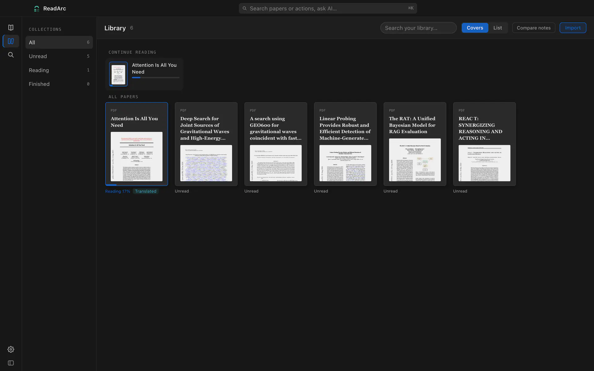
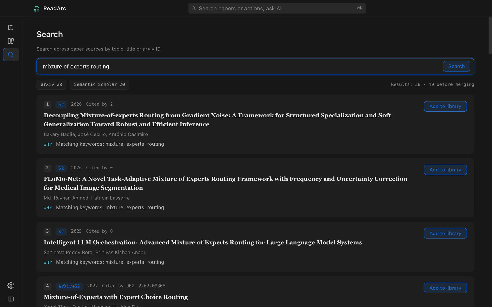
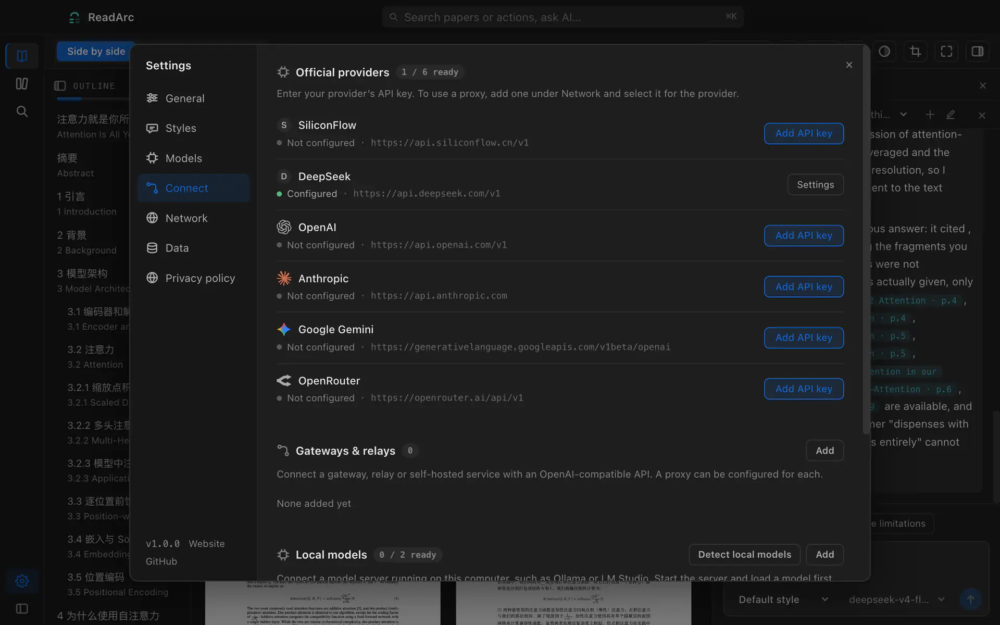

<div align="center">

**English** | [中文](README.md)

# [ReadArc](https://readarc.ai/en/)

### Read papers, effortlessly.

<a href="https://apps.apple.com/cn/app/readarc/id6803315888?mt=12&amp;l=en-GB">
  
</a>

A local-first AI desktop app for research reading: side-by-side translation with the layout preserved, answers that point back to the source, Markdown notes, and a genuinely free choice of models.

[](https://github.com/ReadArc-ai/ReadArc/actions/workflows/ci.yml)
[](LICENSE)
[](https://readarc.ai/en/)
[](#two-ways-to-get-it)
[](#two-ways-to-get-it)
[](#bring-your-own-model)



**[Get it free on the Mac App Store](https://apps.apple.com/cn/app/readarc/id6803315888?mt=12&l=en-GB) · [Website](https://readarc.ai/en/)**

<sub>The open-source build and the App Store build have the same features. Papers and notes are stored locally; AI requests go directly to your chosen service.</sub>

</div>

## Why ReadArc

Most reference tools are good at collecting. ReadArc is about understanding. Once a PDF is imported you can translate it side by side, look up words, highlight, ask questions and take notes in one place, without carrying context back and forth between a browser, a chat window and a notes app.

## Core features

| Feature | What you can do |
| --- | --- |
| **Side-by-side reading** | Switch between the original PDF, side-by-side view and mirrored translation to read each passage in context. |
| **Paper layout recognition** | Identify body text, headings, figures, tables, equations and footnotes, aiming to preserve their positions and correspondence on the translated page. |
| **Multilingual translation** | Translate a paragraph or an entire paper into Chinese, English, Japanese, Korean, German, French or Spanish. |
| **AI answers with citations** | Ask about a paragraph, screenshot or whole paper, then follow citations in the answer to check the original text. |
| **Offline dictionary** | Double-click an English word for its meaning. Around 170,000 entries are available locally; a dictionary hit needs no network or tokens. |
| **Summaries and reading insights** | Stream three-sentence summaries and structured reading notes, and explore conflicting claims across papers. |
| **Highlights and Markdown notes** | Save highlights and annotations as local Markdown files for further organisation in Obsidian or Git. |
| **Paper search and library** | Search arXiv and Semantic Scholar together, merge and deduplicate results, and download papers into your library in one click. Reading progress is saved automatically. |
| **Your choice of models** | Bring your own API key for cloud services or OpenAI-compatible APIs, or connect local models through Ollama and LM Studio. Choose a model for each task. |
| **Cost estimates and usage tracking** | Preview translation costs, confirm estimates above US$0.50 before proceeding, and check model usage at any time. |

<table>
  <tr>
    <td></td>
    <td></td>
  </tr>
  <tr>
    <td align="center"><sub>Library with reading progress</sub></td>
    <td align="center"><sub>Multi-source search with one-click import</sub></td>
  </tr>
</table>

## Two ways to get it

### Mac App Store

For people who want it to just work: Apple handles installation and automatic updates, no development setup needed. Get the App Store version free during our Mid-Autumn & National Day offer, September 25–October 25, 2026.

**[Get ReadArc free on the Mac App Store →](https://apps.apple.com/cn/app/readarc/id6803315888?mt=12&l=en-GB)**

This month-long offer covers the app itself; cloud model API usage is billed separately by your chosen provider. The link opens the China storefront in English.

### Build from source · free

The full source is open under Apache-2.0. A build you make yourself has the same code and the same features as the App Store build. There is no paywall. The only differences are distribution, signing and updates.

GitHub carries the source only. No prebuilt DMG, PKG or `.app` is published. If you want a signed install with automatic updates, get ReadArc from the Mac App Store.

The primary development and testing platform is **macOS** (11 or newer). Building from source needs Node.js 22.19.0 or newer.

```bash
git clone https://github.com/ReadArc-ai/ReadArc.git
cd ReadArc

npm ci
npm run model:download   # downloads and verifies the ~204 MB layout model
npm run dev              # start in development mode
```

To build an unsigned `.app` for your own use:

```bash
npm run pack
open release/mac-arm64/ReadArc.app
```

`npm run model:download` checks PP-DocLayoutV2 against a pinned SHA-256. Running it again only verifies, it does not download twice. Without the model ReadArc falls back to heuristic layout parsing. Basic reading still works, but complex papers are recognised less accurately.

**A Windows version is in development.** The Linux configuration is experimental. Neither has official builds yet; help testing them is welcome.

## What a reading session looks like

1. Drop in a local PDF, or search arXiv and Semantic Scholar and add a paper to your library.
2. Switch between the original, side-by-side and mirrored translation views. Double-click to look up a word. Select text to highlight it, write a note or ask the AI.
3. Keep asking about a hard passage, or generate a whole-paper summary and structured reading notes. Answers keep citations you can follow back to the text.
4. When you switch papers, reading position, anchors, cached translations and Markdown notes all stay on your machine, so you pick up where you left off.

## Bring your own model

ReadArc does not sell tokens and does not proxy your model requests. Open Settings (`⌘,`) and pick a different model for each task:

- official services such as OpenAI, Anthropic, Gemini, DeepSeek, SiliconFlow and OpenRouter;
- any OpenAI-compatible API, self-hosted gateway or compatible endpoint;
- local models through Ollama or LM Studio, for offline use or sensitive material.

Translation can go to a cheaper model while deep questions use a stronger one. API keys are stored in `~/.readarc/.env` on your machine. The main config stores the environment variable name; requests send the key to the configured endpoint for authentication.

<p align="center">
  
</p>

## Privacy and network boundary

Read the full [Privacy Policy](PRIVACY.en.md), also available offline in Settings → Privacy policy and Help → Privacy policy.

ReadArc has no accounts, no cloud sync, no relay and no telemetry. PDF copies, parsed content, reading progress, cached translations, chat history and notes are stored locally by default.

Data leaves your device only when you use the feature that needs it:

| Action | Sent to | What may be sent |
| --- | --- | --- |
| AI translation, questions, summaries | The model provider or local endpoint you chose | The paper text, context or screenshot needed for that task |
| Paper search | arXiv, Semantic Scholar; the selected model when rewriting Chinese queries | Search terms or rewritten keywords |
| Word lookup after an offline dictionary miss | The selected model | Lookup text and task context |
| Model lists / local model detection | Configured endpoints or local model services | List requests, authenticated with an API key if required |
| Proxy connection test | The configured proxy and Google connectivity endpoint | A test request without paper content |
| Adding a search result | The paper's source site | A PDF download request |

The Mac App Store build is sandboxed and keeps notes inside the app container. See Settings → Data for the actual location. The source build uses `~/Documents/ReadArc/Notes`. When cleaning up or reporting a problem, do not upload real papers, the database or `~/.readarc/.env`.

## Development

```bash
npm run typecheck
npm run lint
npm test
npm run build
```

Please read [CONTRIBUTING.md](CONTRIBUTING.md) before contributing. Bugs and feature requests go to [Issues](https://github.com/ReadArc-ai/ReadArc/issues). Report security problems privately as described in [SECURITY.md](SECURITY.md). Guides and news are on the [website](https://readarc.ai/en/).

## FAQ

<details>
<summary><strong>Does the App Store build have more features than the source build?</strong></summary>

No. Both come from the same source and have the same features. The App Store build provides a signed, convenient install and automatic updates. It is free to get during this Mid-Autumn & National Day offer.

</details>

<details>
<summary><strong>Do I have to buy an API or use a cloud model?</strong></summary>

No. You can connect Ollama or LM Studio and run models locally, or skip AI entirely and use PDF reading, the library, offline dictionary, highlights and notes. Results depend on the model you choose.

</details>

<details>
<summary><strong>Why isn't the model file in the Git repository?</strong></summary>

PP-DocLayoutV2 is about 204 MB. The build script downloads it from a fixed source and checks it against the SHA-256 recorded in the repository. This keeps the repository small and makes the origin and integrity verifiable.

</details>

<details>
<summary><strong>Can I publish a fork under the ReadArc name?</strong></summary>

No. The code is Apache-2.0, but the "ReadArc" name, logo and app icon are trademarks and are not covered by the code licence (see [NOTICE](NOTICE)). A modified or redistributed build must not use the ReadArc name or icon, must not be submitted to any app store as ReadArc, and must not suggest it is published or endorsed by ReadArc. The LICENSE, NOTICE and third-party attribution files must be kept. The only official channels are this repository and the Mac App Store.

</details>

## Licence and credits

ReadArc source is released under the [Apache License 2.0](LICENSE). Trademark scope is described in [NOTICE](NOTICE); third-party attributions and licences are in [THIRD_PARTY_NOTICES.md](THIRD_PARTY_NOTICES.md).

Core third-party resources include [PDF.js](https://github.com/mozilla/pdf.js), [PaddleOCR / PP-DocLayoutV2](https://github.com/PaddlePaddle/PaddleOCR), [RapidLayout](https://github.com/RapidAI/RapidLayout), [ECDICT](https://github.com/skywind3000/ECDICT), [Lobe Icons](https://github.com/lobehub/lobe-icons) and [Feather Icons](https://github.com/feathericons/feather). Thanks to these projects and their contributors.
