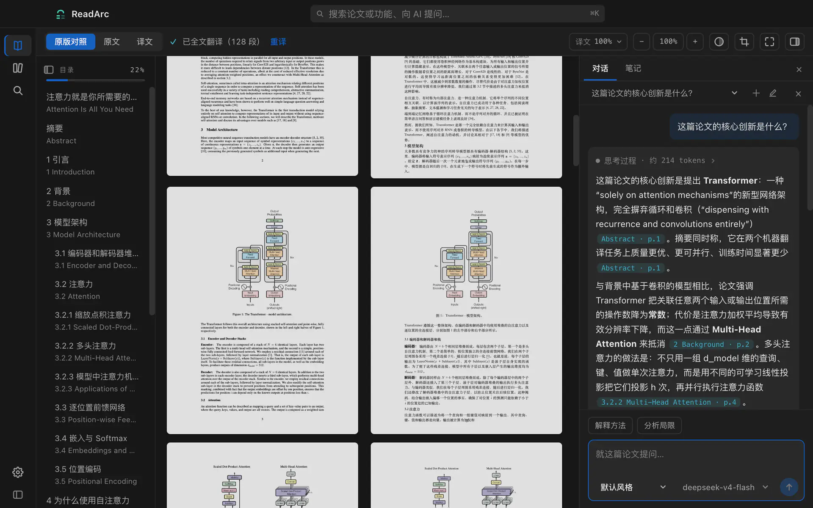
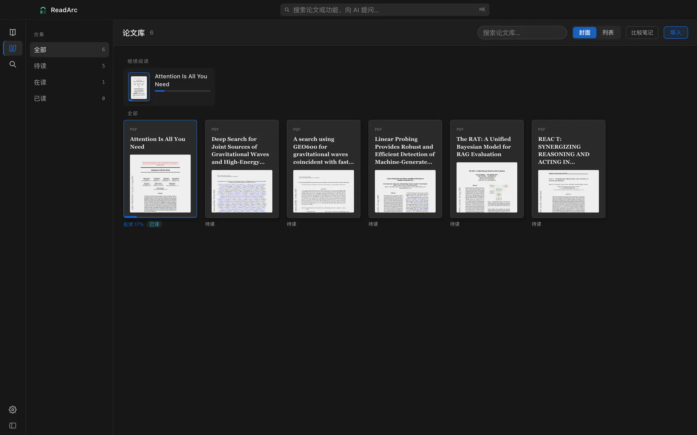
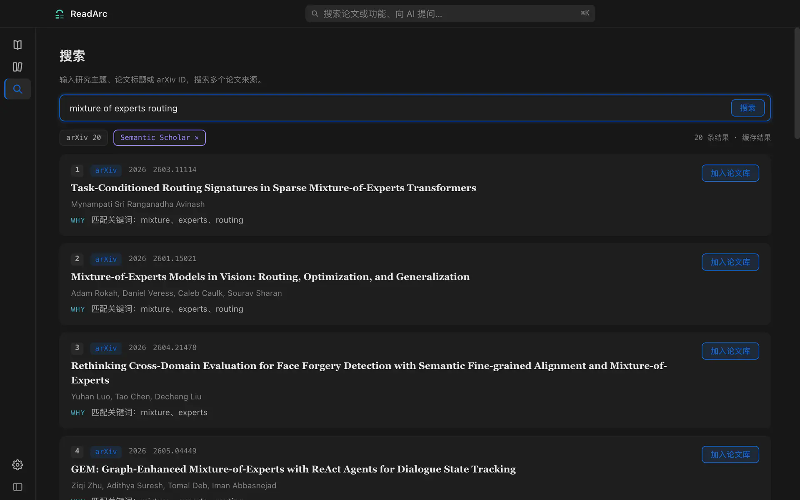
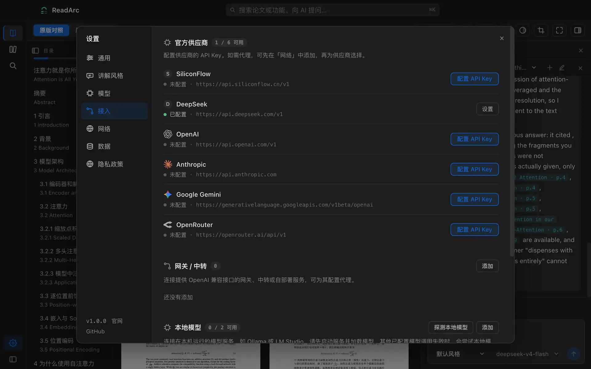

<div align="center">

[English](README.en.md) | **中文**

# [ReadArc](https://readarc.ai/)

### 把论文读懂，而不只是收进库

一款面向研究阅读的 local-first AI 桌面应用：原文与译文对照、版面保真、可追溯问答、Markdown 笔记，以及真正自由的模型选择。

[](https://github.com/ReadArc-ai/ReadArc/actions/workflows/ci.yml)
[](LICENSE)
[](https://readarc.ai/)
[](#两种获得方式)
[](#两种获得方式)
[](#自由选择你的模型)



**[在 Mac App Store 获取](https://apps.apple.com/cn/app/readarc/id6803315888?mt=12) · [官网](https://readarc.ai/)**

<sub>开源源码与 App Store 版本功能一致。论文与笔记保存在本机，AI 请求直连你选择的服务。</sub>

</div>

## 为什么是 ReadArc

大多数文献工具擅长“收藏”，ReadArc 专注于“理解”。导入一篇 PDF 后，你可以在同一个阅读现场完成对照翻译、查词、高亮、提问和沉淀笔记，不需要在浏览器、聊天窗口与笔记软件之间来回搬运上下文。

## 核心功能

| 功能 | 你可以做什么 |
| --- | --- |
| **原文与译文对照** | 在原文、左右对照和译文镜像三种视图间切换，结合上下文理解论文。 |
| **论文版面识别** | 识别正文、标题、图片、表格、公式和脚注，尽量保留它们在译文页中的位置与对应关系。 |
| **多语言翻译** | 翻译单个段落或整篇论文，目标语言支持中文、英文、日文、韩文、德文、法文和西班牙文。 |
| **带引用的 AI 问答** | 针对段落、截图或整篇论文提问，通过回答中的引用跳转到原文核对。 |
| **离线查词** | 双击英文单词查看释义，内置约 17 万词条；命中本地词典时无需联网，也不消耗 token。 |
| **摘要与阅读洞察** | 流式生成三句话摘要、结构化阅读笔记，辅助发现跨论文的观点矛盾。 |
| **高亮与 Markdown 笔记** | 随读随记，将高亮与批注保存为本地 Markdown 文件，方便用 Obsidian 或 Git 继续整理。 |
| **论文搜索与管理** | 同时检索 arXiv 和 Semantic Scholar，合并去重后一键下载入库；自动保存阅读进度。 |
| **自由选择模型** | 使用自己的 API Key，连接云端服务、OpenAI-compatible API 或 Ollama、LM Studio 本地模型，按任务选择模型。 |
| **成本估算与用量记录** | 翻译前查看预计费用，估算超过 US$0.50 时先确认；随时查看模型用量。 |

<table>
  <tr>
    <td></td>
    <td></td>
  </tr>
  <tr>
    <td align="center"><sub>论文库与阅读进度</sub></td>
    <td align="center"><sub>多源检索与一键入库</sub></td>
  </tr>
</table>

## 两种获得方式

### Mac App Store

适合希望开箱即用的用户：由 Apple 完成安装与自动更新，无需准备开发环境。一次购买也直接支持 ReadArc 的长期维护。

**[在 Mac App Store 获取 ReadArc →](https://apps.apple.com/cn/app/readarc/id6803315888?mt=12)**

现已上架，一次购买。

### 从源码构建 · 免费

完整源码以 Apache-2.0 开放。自行构建的版本与 App Store 版本使用同一套代码和功能，不设付费功能墙；区别只在分发、签名和更新方式。

GitHub 仅提供源码，不发布预编译的 DMG、PKG 或 `.app`。希望直接安装和自动更新，请从 Mac App Store 获取付费版本。

当前主要开发和验证平台是 **macOS**（11 或更高版本）。从源码构建需要 Node.js 22.19.0 或更高版本。

```bash
git clone https://github.com/ReadArc-ai/ReadArc.git
cd ReadArc

npm ci
npm run model:download   # 下载并校验约 204 MB 的版面识别模型
npm run dev              # 开发模式启动
```

构建一份供自己使用的未签名 `.app`：

```bash
npm run pack
open release/mac-arm64/ReadArc.app
```

`npm run model:download` 会用固定 SHA-256 验证 PP-DocLayoutV2；重复执行只做校验，不会重复下载。若暂时不安装模型，ReadArc 会退回启发式版面解析，基础阅读仍可使用，但复杂论文的识别精度会降低。

**Windows 版本正在开发中**；Linux 配置仍处于实验状态。两者目前都不提供官方构建，欢迎帮助验证和完善。

## 一次阅读可以怎样展开

1. 拖入本地 PDF，或从 arXiv / Semantic Scholar 搜索并加入论文库。
2. 在原文、左右对照、译文镜像三种视图间切换；双击查词，选中内容即可高亮、记笔记或问 AI。
3. 对难懂段落继续追问，或者生成全文摘要与结构化阅读笔记；所有回答都尽量保留可回到原文的引用。
4. 换一篇论文时，阅读进度、锚点、译文缓存与 Markdown 笔记都留在本机，下次从原处继续。

## 自由选择你的模型

ReadArc 不出售 token，也不代理你的模型请求。打开设置（`⌘,`）后，可以按任务选择不同模型：

- OpenAI、Anthropic、Gemini、DeepSeek、SiliconFlow、OpenRouter 等官方服务；
- 任意 OpenAI-compatible API、自建网关或兼容端点；
- Ollama、LM Studio 等本地模型，适合断网或私密材料。

翻译可以交给更经济的模型，深度问答可以使用更强的模型。API Key 保存在本机 `~/.readarc/.env`，主配置只保存环境变量名；请求模型服务时，密钥会发送给所配置的端点用于认证。

<p align="center">
  
</p>

## 隐私与网络边界

完整政策见 [隐私政策](PRIVACY.md)，应用内可通过“设置 → 隐私政策”或“帮助 → 隐私政策”离线阅读。

ReadArc 没有自建账号系统、云同步、请求中转或遥测服务。PDF 副本、解析结果、阅读进度、译文缓存、聊天记录和笔记默认保存在本机。

只有当你主动使用相应功能时，以下内容才会离开设备：

| 操作 | 发送到哪里 | 可能发送的内容 |
| --- | --- | --- |
| AI 翻译、问答、摘要 | 你选择的模型供应商或本地端点 | 当前任务所需的论文文本、上下文或截图 |
| 搜索论文 | arXiv、Semantic Scholar；中文查询改写时还会使用所选模型 | 搜索词或改写后的关键词 |
| 划词查词未命中离线词典 | 所选模型 | 查询词与任务上下文 |
| 获取模型列表 / 检测本地模型 | 所配置的端点或本机模型服务 | 列表请求，必要时使用 API Key 认证 |
| 测试代理 | 所配置的代理、Google 连通性测试端点 | 不含论文内容的测试请求 |
| 从搜索结果入库 | 论文来源网站 | PDF 下载请求 |

Mac App Store 沙盒版将笔记写在应用容器中；可在“设置 → 数据”查看实际位置。源码构建版默认使用 `~/Documents/ReadArc/Notes`。清理或报告问题前，请勿上传真实论文、数据库或 `~/.readarc/.env`。

## 开发

```bash
npm run typecheck
npm run lint
npm test
npm run build
```

贡献前请阅读 [CONTRIBUTING.md](CONTRIBUTING.md)。Bug 和功能建议可提交 [Issue](https://github.com/ReadArc-ai/ReadArc/issues)；安全问题请按 [SECURITY.md](SECURITY.md) 私下报告。使用说明与更新动态见 [官网](https://readarc.ai/)。

## 常见问题

<details>
<summary><strong>App Store 版比源码版多功能吗？</strong></summary>

没有。两个版本来自同一份源码，功能一致。App Store 费用对应经过签名的便捷安装、自动更新，以及对项目持续维护的支持。

</details>

<details>
<summary><strong>一定要购买 API 或使用云模型吗？</strong></summary>

不用。你可以连接 Ollama 或 LM Studio 在本机运行模型；也可以完全不配置 AI，仅使用 PDF 阅读、论文库、离线查词、高亮与笔记等能力。实际效果取决于所选模型。

</details>

<details>
<summary><strong>为什么模型文件不直接放进 Git 仓库？</strong></summary>

PP-DocLayoutV2 约 204 MB。构建脚本从固定来源下载，并核对仓库记录的 SHA-256，既减小仓库体积，也让来源和完整性可检查。

</details>

<details>
<summary><strong>fork 之后可以用 ReadArc 的名字发布吗？</strong></summary>

不可以。代码遵循 Apache-2.0，但「ReadArc」名称、Logo 和应用图标是商标，不在代码许可范围内（见 [NOTICE](NOTICE)）。任何修改版或再分发版都不得使用 ReadArc 的名称与图标，不得以 ReadArc 的名义上架任何应用商店，也不得暗示由 ReadArc 官方发布或背书；同时必须保留 LICENSE、NOTICE 与第三方归属声明。官方发行渠道只有本仓库和 Mac App Store。

</details>

## 许可与致谢

ReadArc 源码采用 [Apache License 2.0](LICENSE)。商标范围见 [NOTICE](NOTICE)，第三方归属与许可见 [THIRD_PARTY_NOTICES.md](THIRD_PARTY_NOTICES.md)。

核心第三方资源包括 [PDF.js](https://github.com/mozilla/pdf.js)、[PaddleOCR / PP-DocLayoutV2](https://github.com/PaddlePaddle/PaddleOCR)、[RapidLayout](https://github.com/RapidAI/RapidLayout)、[ECDICT](https://github.com/skywind3000/ECDICT)、[Lobe Icons](https://github.com/lobehub/lobe-icons) 与 [Feather Icons](https://github.com/feathericons/feather)。感谢这些项目及其贡献者。
